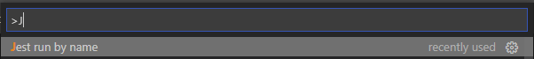
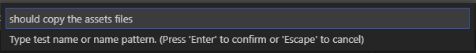
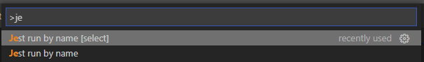
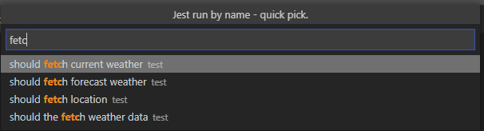
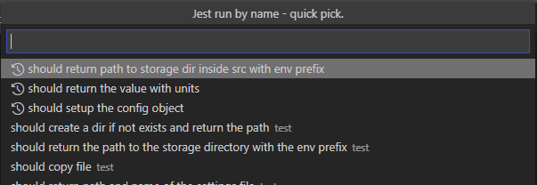
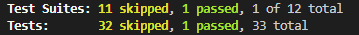

# Jest run by name

Quickly run the Jest test by a test name.

## Features

	- Call >Jest by name< extension


	- Type the test name or name pattern and confirm by ENTER


	- Or you can select one of your tests name using option >Jest by name [select]<


	- Then selecting one of your tests name from the quick pick 


	- The Quick pick mode has a history of the last three selections


	- Then the tests that match the name patter will be executed.



## Requirements

1. [```Jest```](https://jestjs.io/) set up.
> **Jest by name** will be looking for the tests files and therefore for the test by the patterns specified in `jest.config.*s` under `testMatch` (if not specified the default jest value will be used)
2. [```Glob```](https://www.npmjs.com/package/glob) installed - see [Known Issues](#known-issues)
## Extension Settings

/

## Known Issues

- ```vscode.workspace.findFiles``` does not support extended glob patterns [#10851](https://github.com/microsoft/vscode/issues/10851) so [```Glob```](https://www.npmjs.com/package/glob) package is used instead and require to be installed globally.

## Release Notes

### 1.0.0

Initial release of the  **Jest by name** 

-----------------------------------------------------------------------------------------------------------

**UnnamedXAer**
